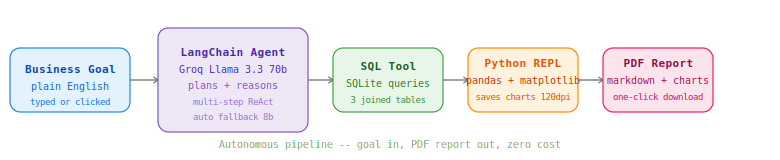

<div align="center">


[](https://github.com/Nevil-Dhinoja)
[](https://www.python.org/)
[](https://streamlit.io/)
[](https://langchain.com/)
[](https://groq.com/)
[](https://sqlite.org/)
[](LICENSE)
[](https://console.groq.com)

<p align="center">
  
</p>

</div>

---



---

## What Is This?

**Data Analyst Agent** is an autonomous AI system that does the full job of a junior data analyst — without being told how. Give it a business question in plain English. The agent breaks it into steps, writes SQL to query the e-commerce database, runs Python to process and visualise the data, saves charts with a consistent style, and produces a structured markdown report with key insights and numbers.

Hit "Run Full Report" and it runs 5 industry-standard analyses back to back and bundles everything into a downloadable PDF.

**The entire stack runs at $0.**

### Key Stats

| Metric | Value |
|--------|-------|
| Agent Framework | LangChain ReAct Agent |
| LLM | Groq Llama 3.3 70b (free tier) |
| Database | SQLite — customers, products, orders |
| Dataset Size | 200 customers, 50 products, 1,000 orders |
| API Cost | $0 / Rs.0 |
| Output | Markdown report + PNG charts + PDF |

---

## How It Works

```
You type a goal
      |
      v
LangChain ReAct Agent (Groq Llama 3.3 70b)
      |
      |-- Thought: what data do I need?
      |-- Action: sql_query
      |-- Observation: raw results
      |
      |-- Thought: now visualise it
      |-- Action: python_repl (pandas + matplotlib)
      |-- Observation: chart saved to outputs/
      |
      v
Final Answer: structured markdown report
      |
      v
Streamlit displays report + charts side by side
      |
      v
PDF export -- one click download
```

**Step 1 - Goal Input.** You type a plain English goal or click a preset from the sidebar.

**Step 2 - Agent Planning.** LangChain's ReAct agent breaks the goal into steps and decides which tool to use at each step.

**Step 3 - SQL Queries.** The `sql_query` tool runs SELECT statements against the SQLite e-commerce database -- customers, products, and orders tables.

**Step 4 - Python Analysis.** The `python_repl` tool runs pandas and matplotlib code. Every chart uses a consistent blue palette and is saved to `outputs/`.

**Step 5 - Report.** The agent writes a markdown report with headers, tables, and bullet insights. Streamlit shows it next to the charts.

**Step 6 - PDF Export.** Click "Export as PDF" on any analysis or "Run Full Report" to bundle all 5 standard analyses into one PDF.

---

## Analysis Types

| Analysis | What It Does | Industry Use |
|----------|-------------|--------------|
| RFM Segmentation | Scores customers on Recency, Frequency, Monetary and labels Champions vs At Risk | CRM, retention teams |
| Revenue Trend + Forecast | Monthly revenue with numpy linear forecast for next 3 months | Finance, planning |
| Funnel Analysis | Order volume at each status stage -- placed to delivered | Product, ops teams |
| Correlation Heatmap | Which variables actually drive each other across joined tables | Data science teams |
| City Revenue Breakdown | Revenue and order volume by geography | Sales teams |
| Category Performance | Revenue, volume and return rate by product category | Merchandising |

---

## Features

| Feature | Detail |
|---------|--------|
| Autonomous reasoning | Agent plans its own steps -- no hand-holding needed |
| SQL tool | Schema-aware queries across 3 joined tables |
| Python REPL | Pandas + matplotlib with consistent chart styling |
| Chart branding | Unified blue palette, clean white background, 120 DPI |
| PDF export | Every analysis exportable as a formatted PDF |
| Full business report | 5 standard analyses run automatically, bundled into one PDF |
| Model fallback | Auto-switches from 70b to 8b if rate limit hit |
| Sidebar presets | 8 single analyses + full report button |

---

## Tech Stack

<div align="center">

### AI / ML


### Data


### Visualisation


### Export


### Interface


</div>

### Project Structure

```
data-analyst-agent/
├── app/
│   ├── main.py          <-- Streamlit UI + full report mode
│   ├── agent.py         <-- LangChain ReAct agent + Groq
│   ├── tools.py         <-- SQL tool + Python REPL + chart style
│   ├── pdf_export.py    <-- PDF report generator
│   └── __init__.py
├── data/
│   └── seed.py          <-- Seeds SQLite e-commerce DB
├── outputs/             <-- Charts and PDFs saved here
├── assets/
│   └── architecture.svg <-- Architecture diagram
├── .streamlit/
│   └── config.toml      <-- Disables file watcher
├── .env                 <-- GROQ_API_KEY
├── .env.example
├── .gitignore
├── requirements.txt
└── README.md
```

---

## Installation & Setup

### Prerequisites

| Software | Version | Purpose |
|----------|---------|---------|
| Python | 3.10+ | Runtime |
| pip | Latest | Packages |
| Groq API Key | Free | LLM inference |

### Clone

```bash
git clone https://github.com/Nevil-Dhinoja/data-analyst-agent
cd data-analyst-agent
```

### Install

```bash
pip install -r requirements.txt
```

### Configure

```bash
cp .env.example .env
```

```env
GROQ_API_KEY=gsk_your_key_here
```

Get a free key at [console.groq.com](https://console.groq.com) -- starts with `gsk_`.

### Seed the database

```bash
python data/seed.py
```

Creates `data/ecommerce.db` with 200 customers, 50 products and 1,000 orders across 8 Indian cities.

### Run

```bash
streamlit run app/main.py
```

Opens at `http://localhost:8501`.

---

## Sample Goals

```
"What are the top 5 cities by total revenue?"
"Segment customers by RFM and identify Champions vs At Risk"
"Show monthly revenue trend for last 12 months and forecast next 3"
"Show the order funnel -- delivered vs cancelled vs returned"
"Find correlations between age, rating, quantity and revenue"
"Which product category has the highest return rate?"
"Find customers who spent more than 50000 total"
"Which payment method is most popular by city?"
```

Or click **Run Full Report** in the sidebar to run all 5 standard analyses at once.

---

## Troubleshooting

| Error | Fix |
|-------|-----|
| `Rate limit 429` | Hit daily token limit -- wait 24 min or agent auto-falls back to 8b model |
| `413 Request too large` | Reduce `max_iterations` in `agent.py` from 10 to 6 |
| `FPDFUnicodeEncodingException` | Already handled by `sanitise()` in `pdf_export.py` |
| Charts not showing | Check `outputs/` folder -- agent must have saved a `.png` file |
| PyTorch watcher warning | Already silenced by `.streamlit/config.toml` |

---

## The AI Grid

</div>

<div align="center">

This repo is part of a series of open-source AI tools built at zero cost.

| Project | Stack | What it does |
|---------|-------|-------------|
| [VoiceSQL](https://github.com/Nevil-Dhinoja/voice-sql-assistant) | Whisper · LangChain · Groq · gTTS | Speak to your database — voice in, voice out |
| **Data Analyst Agent** | LangChain · Groq · Pandas · fpdf2 | Autonomous e-commerce analyst with PDF reports |
| RAG Research Assistant | LlamaIndex · ChromaDB · sentence-transformers | Chat with PDFs + web + database simultaneously |

</div>

---

## Roadmap

- [x] Autonomous ReAct agent with SQL + Python tools
- [x] RFM customer segmentation
- [x] Revenue trend analysis
- [x] Funnel analysis
- [x] Correlation heatmap
- [x] Consistent chart styling and branding
- [x] PDF export per analysis
- [x] Full business report mode -- 5 analyses in one PDF
- [x] Auto model fallback (70b -> 8b on rate limit)
- [ ] Upload your own CSV and analyse it
- [ ] Scheduled reports via APScheduler
- [ ] Deploy to Streamlit Cloud

---

## License

MIT -- free to use, fork and build on.

---

<div align="center">


<br/>

<table border="0" cellspacing="0" cellpadding="0">
<tr>
<td width="180" align="center" valign="top">


</td>
<td width="30"></td>
<td valign="middle">

<h2 align="left">Nevil Dhinoja</h2>
<p align="left"><i>AI / ML Engineer &nbsp;·&nbsp; Full-Stack Developer &nbsp;·&nbsp; Gujarat, India</i></p>
<p align="left">
I build AI systems that are practical, deployable, and free to run.<br/>
This project is part of a larger series of open-source AI tools — each one<br/>
designed to teach a real concept through a working, shippable product.
</p>

</td>
</tr>
</table>

<br/>

[](https://linkedin.com/in/nevil-dhinoja)
[](https://github.com/Nevil-Dhinoja)
[](mailto:nevil@email.com)

<br/>

If this project helped you or saved you time, a star on the repo goes a long way.

<br/>

[](https://github.com/Nevil-Dhinoja/data-analyst-agent)
&nbsp;
[](https://github.com/Nevil-Dhinoja/data-analyst-agent/fork)

<br/>


</div>
